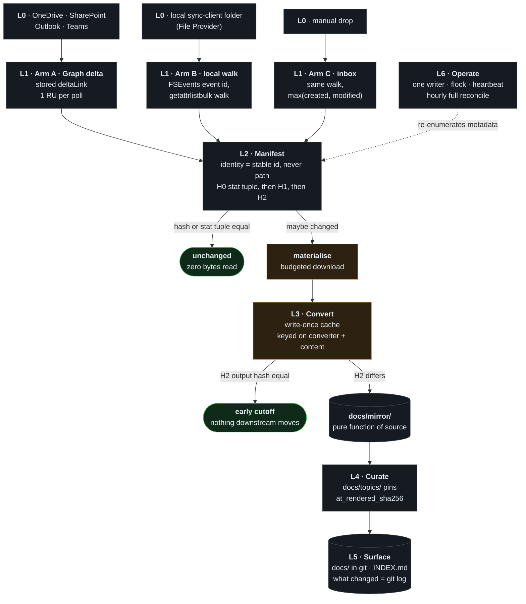
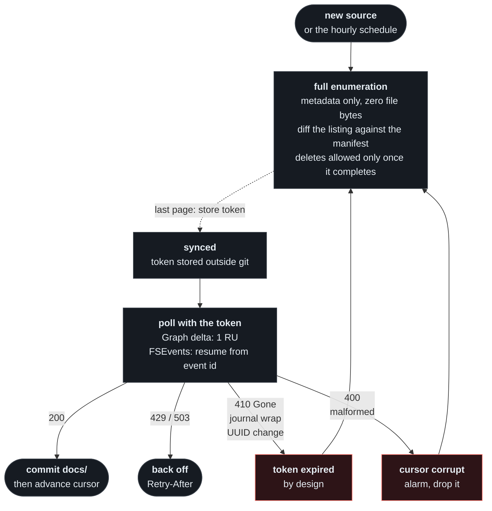
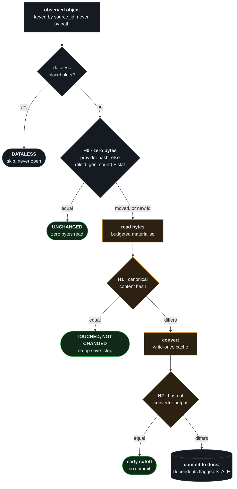

<!-- Hero: a launch film rendered from film/ by `npm run film:loop` (inline WebP) and `npm run film:mp4` (the linked MP4). Direction: docs/design/hero/DIRECTION.md § Launch video. -->
<div>
<a href="docs/media/launch-film.md"><picture>
  <source media="(prefers-color-scheme: dark)" srcset="docs/media/hero-dark.webp">
  
</picture></a>
<br>
<sub><a href="docs/media/launch-film.md">▶ Watch the 26-second launch film</a> · a design with measured probes, not yet an implementation</sub>
</div>

# agent-context-sync

**Keep an agent-readable `docs/` folder in sync with OneDrive, SharePoint, Outlook and Teams by processing only what changed.**
A since-token per source says *what* changed. A manifest with three hashes decides, before a single file byte is read,
whether that change costs anything. Git carries the result, so "what changed since Tuesday" is `git log`.

> [!NOTE]
> **Status: a design with measured probes. There is no implementation yet.** The build order is
> [§10 of the design](docs/design/agent-context-sync.md#10-build-order). It starts once a target corporate tenant is
> chosen, because five of the probes can only be measured there ([what is measured](#four-probes-are-measured-five-still-need-a-corporate-tenant)).

Coding agents answer best from a folder of markdown they can read and grep. A company's knowledge lives somewhere
else: tens of thousands of Office files, PDFs, mail and chat in Microsoft 365, changing in place under the same name,
and mostly online-only on the laptop. Re-reading all of it on every sync means hours of downloads. The design gets the
diff in four steps, and each step exists so that the next one can skip work:

1. **[Ask each source what changed, and make expiry cheap.](#1-ask-each-source-what-changed-and-make-expiry-cheap)**
   A Graph delta link, an FSEvents event id or a metadata walk. When a token expires, the fallback compares metadata
   and reads zero file bytes.
2. **[Decide with three hashes before reading a byte.](#2-decide-with-three-hashes-before-reading-a-byte)**
   H0 decides whether to read, H1 whether to convert, H2 whether anything downstream changed. Office changes bytes on
   every no-op save, and H2 is what makes that save free.
3. **[Read bytes only on purpose.](#3-read-bytes-only-on-purpose)**
   An online-only file is a placeholder. The pipeline refuses to download it by default, and one budgeted step opts in.
4. **[Publish a pure function of the source, in git.](#4-publish-a-pure-function-of-the-source-in-git)**
   Converted pages are machine-generated and diffable, and each curated page records which version of each source it
   was written from.

<!-- Diagram source: docs/diagrams/pipeline.mmd — edit it, run `npm run diagrams`, commit the regenerated SVGs. -->
<picture>
  <source media="(prefers-color-scheme: dark)" srcset="docs/diagrams/pipeline-dark.svg">
  
</picture>

<details>
<summary>Interactive Diagram</summary>

<!-- mermaid-fence: docs/diagrams/pipeline.mmd (auto-synced by `npm run diagrams`) -->


<sup><a href="docs/diagrams/pipeline-dark.svg?raw=true">full-screen dark</a> · <a href="docs/diagrams/pipeline-light.svg?raw=true">light</a> · <a href="docs/diagrams/pipeline.mmd">source</a></sup>

</details>

<sub>Colour means cost: amber steps read file bytes, green steps are free exits, everything else touches metadata only.</sub>

## 1. Ask each source what changed, and make expiry cheap

Every source already keeps a change log of its own. The pipeline stores one since-token per source and asks for the
changes since that token, instead of looking at the files:

| Source | Since-token | Cost of asking |
|---|---|---|
| OneDrive, SharePoint, Outlook folders, Teams channels | Microsoft Graph `deltaLink` | 1 resource unit per poll: a drive polled every 60 s uses 0.12 % of the smallest per-app daily budget (Microsoft's published defaults) |
| A folder synced by the OneDrive client | FSEvents event id, backed by a `getattrlistbulk` metadata walk | 0.13–0.31 s per 100,000 files on local APFS ([C11](docs/design/receipts/verify/C11-local-walk.md)); a 2,000-file walk costs the same on OneDrive's File Provider as on local disk ([C14 §3](docs/design/receipts/verify/C14-file-provider.md)) |
| A manual drop folder | the same walk | the same |

**Every token expires by design:** a 410 from Graph, a wrapped FSEvents journal, a changed volume UUID. So the part that
carries the load is the fallback, not the token: list the metadata again, diff it against the manifest, and read no file
bytes. Deletions are trusted only inside a listing that completed.

<!-- Diagram source: docs/diagrams/since-token.mmd — edit it, run `npm run diagrams`, commit the regenerated SVGs. -->
<picture>
  <source media="(prefers-color-scheme: dark)" srcset="docs/diagrams/since-token-dark.svg">
  
</picture>

<details>
<summary>Interactive Diagram</summary>

<!-- mermaid-fence: docs/diagrams/since-token.mmd (auto-synced by `npm run diagrams`) -->


<sup><a href="docs/diagrams/since-token-dark.svg?raw=true">full-screen dark</a> · <a href="docs/diagrams/since-token-light.svg?raw=true">light</a> · <a href="docs/diagrams/since-token.mmd">source</a></sup>

</details>

A symlink into the OneDrive folder cannot play this role. It carries no since-token, and the agent's own tools do not
see through it: in a three-file fixture, ripgrep, BSD `grep -r` and `-R`, `find`, and Claude Code's Grep and Glob each
found 1 of 3 files, all with exit 0, and `git` stores the link as a single blob
([C1](docs/design/receipts/C1-macos-onedrive-symlinks.md)). The local walk, by contrast, gets a real change signal from
the kernel: `ATTR_CMN_GEN_COUNT`, returned for 2,000 of 2,000 File Provider items, placeholders included
([C14 §3](docs/design/receipts/verify/C14-file-provider.md)).

## 2. Decide with three hashes before reading a byte

Identity is the stable id (Graph `driveItem.id`, or the file id locally), never the path, so a folder rename is one
record rather than a subtree of deletes and creates. Each observed object then passes up to three hashes, and every
decision before the byte read costs nothing:

| Hash | Computed from | Decides |
|---|---|---|
| **H0** | the provider's `quickXorHash`, else `(fileid, gen_count)` and the stat tuple | whether to read the bytes at all |
| **H1** | a canonical content hash: sorted `(part, bytes)` with volatile parts removed | whether to convert |
| **H2** | the converter's output | whether anything downstream changed |

<!-- Diagram source: docs/diagrams/classifier.mmd — edit it, run `npm run diagrams`, commit the regenerated SVGs. -->
<picture>
  <source media="(prefers-color-scheme: dark)" srcset="docs/diagrams/classifier-dark.svg">
  
</picture>

<details>
<summary>Interactive Diagram</summary>

<!-- mermaid-fence: docs/diagrams/classifier.mmd (auto-synced by `npm run diagrams`) -->


<sup><a href="docs/diagrams/classifier-dark.svg?raw=true">full-screen dark</a> · <a href="docs/diagrams/classifier-light.svg?raw=true">light</a> · <a href="docs/diagrams/classifier.mmd">source</a></sup>

</details>

H2 is not an optimisation. Real Office apps never re-save a file byte for byte, even with no edit
([C12 §6](docs/design/receipts/verify/C12-office-resave.md)):

| Format | What changed on a no-op save, outside `docProps/` | Converter output (H2) |
|---|---|---|
| `.pptx` | nothing | identical |
| `.xlsx` | `xl/workbook.xml`: a new `documentId` GUID on every save | identical |
| `.docx` | `word/document.xml` and `word/settings.xml`: new revision-save ids (`w:rsid*`) | identical |

A LibreOffice round trip changed the styles part and every sheet. Without H2, each of those saves would become a commit
that says nothing. The bookkeeping is cheap: a 200,000-row manifest is 31 MB of JSON and loads in 0.12 s
([design §4.1](docs/design/agent-context-sync.md#41-the-seven-invariants)).

## 3. Read bytes only on purpose

On macOS, OneDrive keeps most files online-only: a placeholder with the full size, zero allocated blocks and the
`SF_DATALESS` flag. Whether reading one downloads it depends on the caller's materialization policy, and the default
differs by context. This is a real run of the probes against a OneDrive for Business folder:

<p align="center">
  
</p>

<sub>`launchd-run.sh` submits `readfp` as a real launchd job, which reports its default policy: off. `readfp off` applies
that policy to the placeholder, and the read fails with `EDEADLK`. The login shell's default is on, so the same read
downloads 2 MB. The direct read from a launchd job fails the same way, errno 11
([C14 §2](docs/design/receipts/verify/C14-file-provider.md)). Recorded headlessly with VHS
([`scripts/record-demo.sh`](scripts/record-demo.sh)).</sub>

Two consequences shape the design:

- **A launchd job is fail-closed for free.** The walk and hash stages inherit the refusing policy, and one budgeted
  `materialise()` step opts in with `setiopolicy_np(…_ON)` or the job's `MaterializeDatalessFiles` key.
- **A stray walk from a login shell is a download.** `rg` or a hash pass over the sync folder would pull down the whole
  library, and macOS evicts it again under disk pressure. That is why phase 1 reads no bytes, and why a placeholder is
  recorded as `dataless`, a state distinct from both changed and unchanged.

## 4. Publish a pure function of the source, in git

`docs/mirror/` is generated one to one from the sources and never hand-edited. Its frontmatter holds content-derived
fields only (no `converted_at`), so an unchanged source re-renders to identical bytes. `docs/topics/` is written by the
agent, and each page pins the exact version (`at_rendered_sha256`) of every mirror page it cites. In the design, the two
questions an agent asks are each one command:

```sh
git log --since=2026-09-01 --stat -- docs/mirror   # what changed upstream
sh refresh-queue.sh docs/DEPENDS.tsv               # which curated pages are now stale, and why
```

The refresh queue is one awk pass over a generated `DEPENDS.tsv`: 0.08–0.12 s over 1,600 rows
([C11 §3](docs/design/receipts/verify/C11-local-walk.md)). It reports `STALE`, `SOURCE-DELETED` and `SOURCE-UNREADABLE`
separately because each needs a different action ([design §4.5](docs/design/agent-context-sync.md#45-l4--curation-incrementally)).
Freshness never rides on file times: `git clone` resets every mtime, and Claude Code's Glob orders its results by mtime
([retrieval review](docs/design/receipts/review/retrieval.md)).

## Four probes are measured, five still need a corporate tenant

The probes in [design §9](docs/design/agent-context-sync.md#9-what-to-measure-first-on-the-corporate-tenant) each
decide one part of the architecture. Four ran on a Microsoft 365 Business Standard tenant on macOS 15.7.9 (2026-09-23):

| # | Probe | Result |
|---|---|---|
| 3 | Which FSEvents fire when a file is edited on the web | A downloaded file raises `Modified` on the CloudStorage path within about 20 s. A new folder raises only its directory event, so a new directory needs a walk ([C14 §4](docs/design/receipts/verify/C14-file-provider.md)) |
| 4 | Reading a placeholder, by context | Login shell downloads; launchd job fails `EDEADLK`, errno 11 ([C14 §2](docs/design/receipts/verify/C14-file-provider.md)) |
| 5 | Walk cost and `GEN_COUNT` on File Provider | `GEN_COUNT` on 2,000 of 2,000 items; walk cost equal to local APFS ([C14 §3](docs/design/receipts/verify/C14-file-provider.md)) |
| 6 | Office no-op re-save | Never byte-stable; H2 identical for `.pptx`, `.xlsx` and `.docx` ([C12 §6](docs/design/receipts/verify/C12-office-resave.md)) |

Five depend on the tenant itself, so they wait for the target one: whether SharePoint libraries return `quickXorHash`
in delta (1), whether a non-admin may consent to `Files.Read.All` and `Sites.Read.All` (2), whether two downloads of a
sensitivity-labelled file are byte-identical (4b), whether the spreadsheet converter reads a real Excel-saved workbook
correctly (8), and how long an idle delta token lives (9).

## Everything behind these numbers is in this repository

| Path | What it holds |
|---|---|
| [`docs/design/agent-context-sync.md`](docs/design/agent-context-sync.md) | The full design: layers L0–L6, seven invariants, 25 ranked failure modes with the element that closes each, rejected alternatives, and the build order |
| [`docs/design/receipts/`](docs/design/receipts/) | 14 research-axis reports, 14 verifier reports and 4 review lenses, with the commands behind each number |
| [`probes/`](probes/) | The macOS probes in C and Swift, plus the Office re-save script. `make -C probes`, then [`probes/README.md`](probes/README.md) |
| [`docs/diagrams/`](docs/diagrams/) | Mermaid sources for the diagrams. `npm run diagrams` re-renders them, and CI fails when a render is stale |

The receipts were published with account names, tenant ids, file names and local paths replaced by placeholders
(Contoso, `user@example.com`, `~/`). Every measurement is unchanged.

## License

[MIT](LICENSE)
