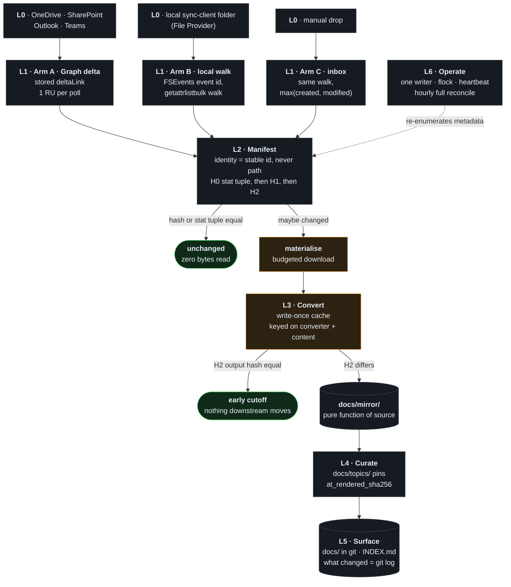
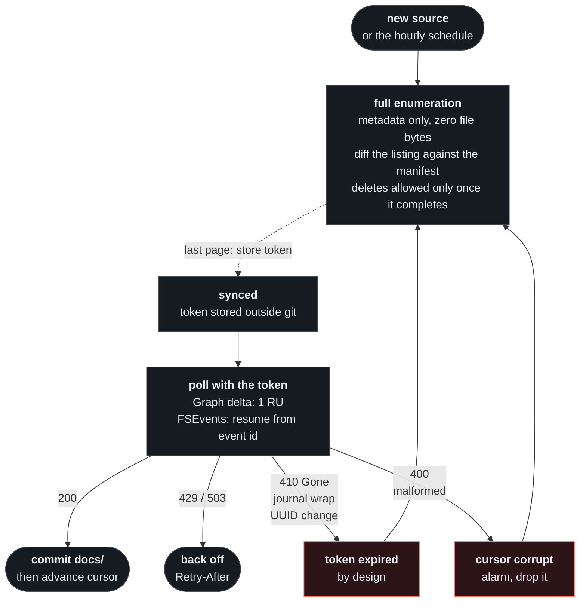
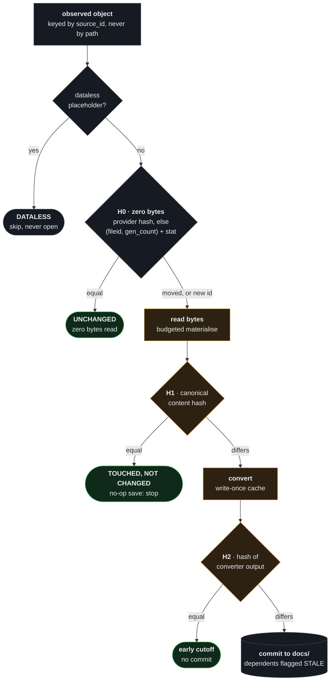

<!-- Hero: a launch film rendered from film/ by `npm run film:loop` (inline WebP) and `npm run film:mp4` (the linked MP4). Direction: docs/design/hero/DIRECTION.md § Launch video. -->
<div>
<a href="docs/media/launch-film.md"><picture>
  <source media="(prefers-color-scheme: dark)" srcset="docs/media/hero-dark.webp">
  
</picture></a>
<br>
<sub><a href="docs/media/launch-film.md">▶ Watch the 26-second launch film</a> · a design with measured probes, implemented as <code>agentsync</code></sub>
</div>

# agent-context-sync

**Keep an agent-readable `docs/` folder in sync with OneDrive, SharePoint, Outlook and Teams by processing only what changed.**
A since-token per source says *what* changed. A manifest with three hashes decides, before a single file byte is read,
whether that change costs anything. Git carries the result, so "what changed since Tuesday" is `git log`.

> [!NOTE]
> **Status: implemented.** The design's build order ([§10](docs/design/agent-context-sync.md#10-build-order), weeks
> 1–3) is built as [`src/agentsync/`](src/agentsync/), the command-line tool `agentsync`. It has the local walk and
> inbox arms, the SQLite manifest with the H0/H1/H2 classifier, converters with a write-once cache, `docs/mirror/` with
> one git commit per cycle, the Graph drive, mail and Teams arms, the curation map with its STALE lint, and a
> single-writer LaunchAgent. It was built and measured on this Mac, including runs against a live OneDrive File
> Provider mount: a no-op cycle over the live OneDrive source fell from 12.9 s to 0.51 s in commit `209bc80`.
>
> - **Works with zero IT involvement:** a `local` source over the OneDrive sync folder, plus a manual `inbox`
>   ([day 1](docs/deploy/README.md#day-1-with-zero-it-involvement)). [Install](#install) needs no admin rights.
> - **Needs the tenant:** the Graph arms (libraries you do not sync, Outlook folders, Teams channels and chats)
>   need an Entra app registration and admin consent from IT ([`docs/deploy/it-request.md`](docs/deploy/it-request.md)).
>   Five probes can still only be measured on the target tenant
>   ([what is measured](#four-probes-are-measured-five-still-need-a-corporate-tenant)). After sign-in,
>   `scripts/tenant-probes.sh` runs probes 1, 2, 4b and 9, and probe 8 is run by hand.
> - **Rollout:** [the dated rollout](docs/plans/implementation.md#rollout--dated) names an owner and a proof command
>   for each step. Its readiness table lists what is still open.
>
> **CORRECTED (2026-09-29):** this note said "**Status: a design with measured probes. There is no implementation
> yet.** The build order is §10 of the design. It starts once a target corporate tenant is chosen, because five of
> the probes can only be measured there." The hero line said "a design with measured probes, not yet an
> implementation". The implementation landed on 2026-09-29, and it did not wait for the tenant. The arms that need no
> tenant run today, and the Graph arms wait only on the IT request.

## Set up on a new Mac: one prompt

Copy this block into Claude Code, GitHub Copilot CLI or any coding agent that can run shell commands on the Mac. The
agent lists your synced folders, asks you one question (which to sync), and runs one install command, which installs,
syncs once, starts background sync and waits for you. You click Allow at most twice: once if macOS asks about this
terminal app, and once for agentsync-launcher. It writes the IT request as a draft it never sends, and it ends with a redacted setup report (outcome, timings and every point that was not one command)
for you to review and bring back ([how reports are used](docs/deploy/setup-feedback.md)). Doing it by hand instead: [Install](#install).

```text
Set up agentsync on this Mac (setup prompt v6). agentsync keeps a local, agent-readable git repo (~/agent-context/docs)
in sync with the OneDrive and SharePoint folders this Mac syncs. Source: https://github.com/renchris/agent-context-sync
(docs/deploy/README.md there explains every step). Run each command yourself and show me its output.
Rules: no sudo; never push, upload or email anything; do not edit my shell profile; do not change Keychain, MDM,
System Settings or privacy (TCC) settings; do not delete, reset or stash anything; do not open or read the files
inside my OneDrive folders. If a command fails and this prompt does not say what to do, log it and go to step 3. If
your tool refuses a command, show it to me to run myself.
Friction log: from step 1 on, whenever something happens that is not in this prompt, log it with
`~/src/agent-context-sync/scripts/install.sh --log '<step>' '<kind>' '<what happened>' '<what would have avoided it, or ->'`
Keep the single quotes and write ’ instead of ' inside them. <kind> is one of: question (you asked me something
other than which folders to sync); click (I clicked something other than an Allow this prompt announced); approval
(your tool asked me to approve a command, if you can see that); deviation (you did something this prompt did not
say, or worked around a problem); error (a command failed; include its exit code); prompt (this prompt was wrong or
unclear; include better wording). Do not log the steps themselves; the installer times them.

1. Preflight, code and folders, in one command (replace <agent> with your tool and model id):
   `sw_vers -productVersion && xcode-select -p && { if [ -d ~/src/agent-context-sync/.git ]; then git -C ~/src/agent-context-sync pull --ff-only; else git clone https://github.com/renchris/agent-context-sync.git ~/src/agent-context-sync; fi; } && ~/src/agent-context-sync/scripts/install.sh --version && ~/src/agent-context-sync/scripts/install.sh --log-start '<agent>' && ~/src/agent-context-sync/scripts/install.sh --list-folders`
   Before running it, tell me macOS may ask whether this terminal app can access files managed by OneDrive, and
   that I should click Allow. If xcode-select printed no path, tell me: "Install the Xcode Command Line Tools with
   `xcode-select --install`, or request them from IT through Self Service if that asks for an admin password; then
   paste this prompt again", and stop. If git failed, show me its error (a corporate proxy may need HTTPS_PROXY set)
   and stop. If --version does not end with "setup-prompt-compat 6" or higher, tell me the published installer is
   older than this prompt and stop. If --list-folders printed no folder paths (only a NEXT: line), do what that line
   says if it is a click for me, otherwise show it to me and go to step 3. Otherwise show me the folders and ask which to
   sync, suggesting project folders rather than a whole library, and tell me that online-only files in them are
   downloaded by background sync, up to 1 GiB per folder per run.
2. Install and start. Tell me: "macOS will ask whether agentsync-launcher may access files managed by OneDrive.
   Click Allow when it appears." Then run, with one --source-local per folder I chose (full paths), using the
   longest command timeout your tool allows (10 minutes if you can set it):
   `~/src/agent-context-sync/scripts/install.sh --source-local "<folder>" --confirm-install-agent`
   It installs, runs doctor, converts the files already on this Mac, starts background sync and waits until the
   background job is running. It is safe to re-run: if your tool stopped it early, run the same command again. If
   your tool cannot wait that long in the foreground, run it in the background and read its output until the NEXT:
   line appears; that is expected, not a deviation. If it exits non-zero, do what NEXT: says only if it is an
   install.sh or agentsync command or a click for me; otherwise log it and go to step 3.
3. IT request and report, always, even after a failure; this is the last command you run:
   `~/.local/bin/agentsync it-request --out ~/agent-context/it-request-draft.md; ~/src/agent-context-sync/scripts/install.sh --log-end && ~/src/agent-context-sync/scripts/install.sh --report-only`
   (if ~/src/agent-context-sync does not exist, tell me instead that setup stopped before the code was downloaded).
   The IT draft is never sent. The report works out the outcome, times and run type itself, redacts names, and its
   last lines are an issue link and a NEXT: line. Do not send or upload anything.
4. Finish with five lines: the folders synced (full paths); the background sync result; the doctor result;
   ~/agent-context/it-request-draft.md and its "You fill:" line; and ~/agent-context/setup-report.md with the issue
   link, which I review before pasting the report there or copying it back privately.
```

<details>
<summary><b>Fewer approval prompts</b> (optional: rules you add yourself, before pasting the block)</summary>

Your coding tool asks before it runs most commands, and each ask is an approval. These rules let the block's
commands, exactly as written above, run without asking. They are optional and only you add them (the block never
asks the agent to change its tool's settings); remove them after setup if you like. Start the tool in your home
folder, so the files the block writes are inside its working folder.

**Claude Code:** merge this into `~/.claude/settings.json` ([permission rules](https://code.claude.com/docs/en/permissions)).
Claude Code checks each part of a compound command (`&&`, `;`) on its own, so step 1 needs the first six rules.
The block logs every friction line with `install.sh --log`, never with a `>>` redirect, because Claude Code's
documentation says a `>>` target that starts with `~` always needs approval, whatever the rules say.

```json
{
  "permissions": {
    "allow": [
      "Bash(sw_vers -productVersion)",
      "Bash(xcode-select -p)",
      "Bash([ -d ~/src/agent-context-sync/.git ])",
      "Bash(git -C ~/src/agent-context-sync pull --ff-only)",
      "Bash(git clone https://github.com/renchris/agent-context-sync.git ~/src/agent-context-sync)",
      "Bash(~/src/agent-context-sync/scripts/install.sh *)",
      "Bash(~/.local/bin/agentsync it-request *)"
    ]
  }
}
```

**GitHub Copilot CLI:** start it with these flags ([tool permission patterns](https://docs.github.com/en/copilot/reference/copilot-cli-reference/cli-command-reference#tool-permission-patterns)).
Its documentation does not say how it matches a command run by its path or one part of a compound command, so
it may still ask for some of them.

```sh
cd ~ && copilot --allow-tool='shell(sw_vers:*), shell(xcode-select -p), shell(git clone:*), shell(git -C ~/src/agent-context-sync pull:*), shell(~/src/agent-context-sync/scripts/install.sh:*), shell(~/.local/bin/agentsync it-request:*)'
```

</details>

Coding agents answer best from a folder of markdown they can read and grep. A company's knowledge lives somewhere
else: tens of thousands of Office files, PDFs, mail and chat in Microsoft 365, changing in place under the same name,
and mostly online-only on the laptop. Re-reading all of it on every sync means hours of downloads. The design gets the
diff in four steps, and each step exists so that the next one can skip work:

1. **[Ask each source what changed, and make expiry cheap.](#1-ask-each-source-what-changed-and-make-expiry-cheap)**
   A Graph delta link, an FSEvents event id or a metadata walk. When a token expires, the fallback compares metadata
   and reads zero file bytes.
2. **[Decide with three hashes before reading a byte.](#2-decide-with-three-hashes-before-reading-a-byte)**
   H0 decides whether to read, H1 whether to convert, H2 whether anything downstream changed. Office changes bytes on
   every no-op save, and H2 is what makes that save free.
3. **[Read bytes only on purpose.](#3-read-bytes-only-on-purpose)**
   An online-only file is a placeholder. The pipeline refuses to download it by default, and one budgeted step opts in.
4. **[Publish a pure function of the source, in git.](#4-publish-a-pure-function-of-the-source-in-git)**
   Converted pages are machine-generated and diffable, and each curated page records which version of each source it
   was written from.

<!-- Diagram source: docs/diagrams/pipeline.mmd — edit it, run `npm run diagrams`, commit the regenerated SVGs. -->
<picture>
  <source media="(prefers-color-scheme: dark)" srcset="docs/diagrams/pipeline-dark.svg">
  
</picture>

<details>
<summary>Interactive Diagram</summary>

<!-- mermaid-fence: docs/diagrams/pipeline.mmd (auto-synced by `npm run diagrams`) -->

```mermaid
flowchart TD
  GD["<b>L0</b> · OneDrive · SharePoint<br/>Outlook · Teams"]
  FP["<b>L0</b> · local sync-client folder<br/>(File Provider)"]
  MD["<b>L0</b> · manual drop"]
  A["<b>L1 · Arm A · Graph delta</b><br/>stored deltaLink<br/>1 RU per poll"]
  B["<b>L1 · Arm B · local walk</b><br/>FSEvents event id,<br/>getattrlistbulk walk"]
  C["<b>L1 · Arm C · inbox</b><br/>same walk,<br/>max(created, modified)"]
  M["<b>L2 · Manifest</b><br/>identity = stable id, never path<br/>H0 stat tuple, then H1, then H2"]
  U(["<b>unchanged</b><br/>zero bytes read"])
  X["<b>materialise</b><br/>budgeted download"]
  V["<b>L3 · Convert</b><br/>write-once cache<br/>keyed on converter + content"]
  E(["<b>early cutoff</b><br/>nothing downstream moves"])
  MI[("<b>docs/mirror/</b><br/>pure function of source")]
  T["<b>L4 · Curate</b><br/>docs/topics/ pins<br/>at_rendered_sha256"]
  S[("<b>L5 · Surface</b><br/>docs/ in git · INDEX.md<br/>what changed = git log")]
  O["<b>L6 · Operate</b><br/>one writer · flock · heartbeat<br/>hourly full reconcile"]
  GD --> A
  FP --> B
  MD --> C
  A --> M
  B --> M
  C --> M
  M -->|"hash or stat tuple equal"| U
  M -->|"maybe changed"| X
  X --> V
  V -->|"H2 output hash equal"| E
  V -->|"H2 differs"| MI
  MI --> T
  T --> S
  O -.->|"re-enumerates metadata"| M
  classDef neutral fill:#161b22,stroke:#3d444d,color:#e6edf3
  classDef amber fill:#2d2111,stroke:#f0a33a,color:#e6edf3
  classDef green fill:#0f2a19,stroke:#3fb950,color:#e6edf3
  class GD,FP,MD,A,B,C,M,MI,T,S,O neutral
  class X,V amber
  class U,E green
```

<sup><a href="docs/diagrams/pipeline-dark.svg?raw=true">full-screen dark</a> · <a href="docs/diagrams/pipeline-light.svg?raw=true">light</a> · <a href="docs/diagrams/pipeline.mmd">source</a></sup>

</details>

<sub>Colour means cost: amber steps read file bytes, green steps are free exits, everything else touches metadata only.</sub>

## 1. Ask each source what changed, and make expiry cheap

Every source already keeps a change log of its own. The pipeline stores one since-token per source and asks for the
changes since that token, instead of looking at the files:

| Source | Since-token | Cost of asking |
|---|---|---|
| OneDrive, SharePoint, Outlook folders, Teams channels | Microsoft Graph `deltaLink` | 1 resource unit per poll: a drive polled every 60 s uses 0.12 % of the smallest per-app daily budget (Microsoft's published defaults). **CORRECTED (2026-09-29):** the resource-unit figure holds for OneDrive and SharePoint drives only. Outlook and Teams are throttled under their own Graph service limits, not resource units (Outlook: 10,000 requests per 10 min and 4 concurrent requests per app per mailbox), and neither budget is modelled yet. Under auth rung (ii) the per-app bucket belongs to the first-party Microsoft Graph PowerShell app and is shared with every user of that app in the tenant |
| A folder synced by the OneDrive client | FSEvents event id, backed by a `getattrlistbulk` metadata walk | 0.13–0.31 s per 100,000 files on local APFS ([C11](docs/design/receipts/verify/C11-local-walk.md)); a 2,000-file walk costs the same on OneDrive's File Provider as on local disk ([C14 §3](docs/design/receipts/verify/C14-file-provider.md)). **CORRECTED (2026-09-29):** that holds for directories the provider had already listed; the first walk of a never-listed directory is a provider round trip whose cost has no receipt |
| A manual drop folder | the same walk | the same |

**Every token expires by design:** a 410 from Graph, a wrapped FSEvents journal, a changed volume UUID. So the part that
carries the load is the fallback, not the token: list the metadata again, diff it against the manifest, and read no file
bytes. Deletions are trusted only inside a listing that completed.

<!-- Diagram source: docs/diagrams/since-token.mmd — edit it, run `npm run diagrams`, commit the regenerated SVGs. -->
<picture>
  <source media="(prefers-color-scheme: dark)" srcset="docs/diagrams/since-token-dark.svg">
  
</picture>

<details>
<summary>Interactive Diagram</summary>

<!-- mermaid-fence: docs/diagrams/since-token.mmd (auto-synced by `npm run diagrams`) -->

```mermaid
flowchart TD
  ENTRY(["<b>new source</b><br/>or the hourly schedule"])
  SYNC["<b>synced</b><br/>token stored outside git"]
  POLL["<b>poll with the token</b><br/>Graph delta: 1 RU<br/>FSEvents: resume from event id"]
  COMMIT(["<b>commit docs/</b><br/>then advance cursor"])
  WAIT(["<b>back off</b><br/>Retry-After"])
  EXP["<b>token expired</b><br/>by design"]
  BAD["<b>cursor corrupt</b><br/>alarm, drop it"]
  FULL["<b>full enumeration</b><br/>metadata only, zero file bytes<br/>diff the listing against the manifest<br/>deletes allowed only once it completes"]
  ENTRY --> FULL
  FULL -.->|"last page: store token"| SYNC
  SYNC --> POLL
  POLL -->|"200"| COMMIT
  POLL -->|"429 / 503"| WAIT
  POLL -->|"410 Gone<br/>journal wrap<br/>UUID change"| EXP
  POLL -->|"400<br/>malformed"| BAD
  EXP --> FULL
  BAD --> FULL
  classDef neutral fill:#161b22,stroke:#3d444d,color:#e6edf3
  classDef red fill:#2d1417,stroke:#ff7b72,color:#e6edf3
  class ENTRY,SYNC,POLL,COMMIT,WAIT,FULL neutral
  class EXP,BAD red
```

<sup><a href="docs/diagrams/since-token-dark.svg?raw=true">full-screen dark</a> · <a href="docs/diagrams/since-token-light.svg?raw=true">light</a> · <a href="docs/diagrams/since-token.mmd">source</a></sup>

</details>

A symlink into the OneDrive folder cannot play this role. It carries no since-token, and the agent's own tools do not
see through it: in a three-file fixture, ripgrep, BSD `grep -r` and `-R`, `find`, and Claude Code's Grep and Glob each
found 1 of 3 files, all with exit 0, and `git` stores the link as a single blob
([C1](docs/design/receipts/C1-macos-onedrive-symlinks.md)). The local walk, by contrast, gets a change signal from
the kernel: `ATTR_CMN_GEN_COUNT`, returned for 2,000 of 2,000 downloaded File Provider items and for the one placeholder
tested ([C14 §3](docs/design/receipts/verify/C14-file-provider.md)). **CORRECTED (2026-09-29):** this sentence said
"2,000 of 2,000 File Provider items, placeholders included" and called the counter "a real change signal". The 2,000
were all downloaded (`dataless=0`), only one placeholder was tested, the counter also moves on evict/download churn with
no content change, and whether it moves on an in-place edit on File Provider is unmeasured. A moved counter means "hash
to confirm", not "edited".

## 2. Decide with three hashes before reading a byte

Identity is the stable id (Graph `driveItem.id`, or the file id locally), never the path, so a folder rename is one
record rather than a subtree of deletes and creates. Each observed object then passes up to three hashes, and every
decision before the byte read costs nothing:

| Hash | Computed from | Decides |
|---|---|---|
| **H0** | the provider's `quickXorHash`, else `(fileid, gen_count)` and the stat tuple | whether to read the bytes at all |
| **H1** | a canonical content hash: sorted `(part, bytes)` with volatile parts removed | whether to convert |
| **H2** | the converter's output | whether anything downstream changed |

<!-- Diagram source: docs/diagrams/classifier.mmd — edit it, run `npm run diagrams`, commit the regenerated SVGs. -->
<picture>
  <source media="(prefers-color-scheme: dark)" srcset="docs/diagrams/classifier-dark.svg">
  
</picture>

<details>
<summary>Interactive Diagram</summary>

<!-- mermaid-fence: docs/diagrams/classifier.mmd (auto-synced by `npm run diagrams`) -->

```mermaid
flowchart TD
  O["<b>observed object</b><br/>keyed by source_id, never by path"]
  D{"dataless<br/>placeholder?"}
  DL(["<b>DATALESS</b><br/>skip, never open"])
  H0{"<b>H0 · zero bytes</b><br/>provider hash, else<br/>(fileid, gen_count) + stat"}
  U(["<b>UNCHANGED</b><br/>zero bytes read"])
  R["<b>read bytes</b><br/>budgeted materialise"]
  H1{"<b>H1</b> · canonical<br/>content hash"}
  T(["<b>TOUCHED, NOT CHANGED</b><br/>no-op save: stop"])
  CV["<b>convert</b><br/>write-once cache"]
  H2{"<b>H2</b> · hash of<br/>converter output"}
  EC(["<b>early cutoff</b><br/>no commit"])
  G[("<b>commit to docs/</b><br/>dependents flagged STALE")]
  O --> D
  D -->|"yes"| DL
  D -->|"no"| H0
  H0 -->|"equal"| U
  H0 -->|"moved, or new id"| R
  R --> H1
  H1 -->|"equal"| T
  H1 -->|"differs"| CV
  CV --> H2
  H2 -->|"equal"| EC
  H2 -->|"differs"| G
  classDef neutral fill:#161b22,stroke:#3d444d,color:#e6edf3
  classDef amber fill:#2d2111,stroke:#f0a33a,color:#e6edf3
  classDef green fill:#0f2a19,stroke:#3fb950,color:#e6edf3
  class O,D,DL,H0,G neutral
  class R,H1,CV,H2 amber
  class U,T,EC green
```

<sup><a href="docs/diagrams/classifier-dark.svg?raw=true">full-screen dark</a> · <a href="docs/diagrams/classifier-light.svg?raw=true">light</a> · <a href="docs/diagrams/classifier.mmd">source</a></sup>

</details>

H2 is not an optimisation. Real Office apps never re-save a file byte for byte, even with no edit
([C12 §6](docs/design/receipts/verify/C12-office-resave.md)):

| Format | What changed on a no-op save, outside `docProps/` | Converter output (H2) |
|---|---|---|
| `.pptx` | nothing | identical |
| `.xlsx` | `xl/workbook.xml`: a new `documentId` GUID on every save | identical |
| `.docx` | `word/document.xml` and `word/settings.xml`: new revision-save ids (`w:rsid*`) | identical |

A LibreOffice round trip changed the styles part and every sheet. Without H2, each of those saves would become a commit
that says nothing. **CORRECTED (2026-09-29):** "identical" was measured on the converter's body output only (pandoc
`gfm`, an openpyxl values-and-formulas dump, slide shape text), and on one generated fixture per format, not on a
full mirror page. The design's mirror frontmatter also carries `source_etag`, `source_modified`, `source_version` and
`content_sha256`, which change on every no-op save, so the page as specified would still change; that is a design gap,
and the implementation ([`docs/plans/implementation.md`](docs/plans/implementation.md)) resolves it.

The bookkeeping is cheap: a 200,000-row manifest is 31 MB of JSON and loads in 0.12 s
([design §4.1](docs/design/agent-context-sync.md#41-the-seven-invariants)). **CORRECTED (2026-09-29):** that figure
was measured on a four-field row (path, size, mtime, sha256; 155 B/row,
[D-manifest-buildgraph](docs/design/receipts/D-manifest-buildgraph.md)), not on the design's ~25-field `source` row,
which will be several times larger (estimated from the field count, not measured).

## 3. Read bytes only on purpose

On macOS, OneDrive keeps most files online-only: a placeholder with the full size, zero allocated blocks and the
`SF_DATALESS` flag. Whether reading one downloads it depends on the caller's materialization policy, and the default
differs by context. This is a real run of the probes against a OneDrive for Business folder:

<p align="center">
  
</p>

<sub>`launchd-run.sh` submits `readfp` as a real launchd job, which reports its default policy: off. `readfp off` applies
that policy to the placeholder, and the read fails with `EDEADLK`. The login shell's default is on, so the same read
downloads 2 MB. The direct read from a launchd job fails the same way, errno 11
([C14 §2](docs/design/receipts/verify/C14-file-provider.md)). Recorded headlessly with VHS
([`scripts/record-demo.sh`](scripts/record-demo.sh)).</sub>

Two consequences shape the design:

- **A launchd job is fail-closed for free.** The walk and hash stages inherit the refusing policy, and one budgeted
  `materialise()` step opts in with `setiopolicy_np(…_ON)` or the job's `MaterializeDatalessFiles` key.
  **CORRECTED (2026-09-29):** two limits. (1) `MaterializeDatalessFiles` applies to the whole job
  ([C14 §2](docs/design/receipts/verify/C14-file-provider.md)), so setting it on a job that also walks and hashes
  would switch those stages to downloading; inside that job, `setiopolicy_np(…_ON)` in `materialise()` is the only
  route that keeps them fail-closed. (2) "Fail-closed" covers the materialization policy, not file access: on
  2026-09-24 a freshly built, unapproved `readfp` under launchd blocked inside `open()` on a File Provider path for
  more than 20 s instead of returning `EDEADLK` ([probes/README](probes/README.md#launchd-runsh--run-a-probe-as-a-launchd-job)).
  That is still unexplained, so a new binary may hang rather than fail. Every CloudStorage call needs a per-call
  timeout, and the launchd access matrix (unapproved vs approved binaries) is an open probe.
- **A stray walk from a login shell is a download.** `rg` or a hash pass over the sync folder would pull down the whole
  library, and macOS evicts it again under disk pressure. That is why phase 1 reads no bytes, and why a placeholder is
  recorded as `dataless`, a state distinct from both changed and unchanged.

## 4. Publish a pure function of the source, in git

`docs/mirror/` is generated one to one from the sources and never hand-edited. Its frontmatter holds content-derived
fields only (no `converted_at`), so an unchanged source re-renders to identical bytes. `docs/topics/` is written by the
agent, and each page pins the exact version (`at_rendered_sha256`) of every mirror page it cites. In the design, the two
questions an agent asks are each one command:

```sh
git log --since=2026-09-01 --stat -- docs/mirror   # what changed upstream
sh refresh-queue.sh docs/DEPENDS.tsv               # which curated pages are now stale, and why
```

The refresh queue is one awk pass over a generated `DEPENDS.tsv`: 0.08–0.12 s over 1,600 rows
([C11 §3](docs/design/receipts/verify/C11-local-walk.md)). It reports `STALE`, `SOURCE-DELETED` and `SOURCE-UNREADABLE`
separately because each needs a different action ([design §4.5](docs/design/agent-context-sync.md#45-l4--curation-incrementally)).
Freshness never rides on file times: `git clone` resets every mtime, and Claude Code's Glob orders its results by mtime
([G §4](docs/design/receipts/G-agent-docs-conventions.md) measures the clone reset;
[C7 (a)](docs/design/receipts/verify/C7.md) the mtime ordering). **CORRECTED (2026-09-29):** this cited the
[retrieval review](docs/design/receipts/review/retrieval.md), which contains neither measurement.

## Four probes are measured, five still need a corporate tenant

The probes in [design §9](docs/design/agent-context-sync.md#9-what-to-measure-first-on-the-corporate-tenant) each
decide one part of the architecture. Four ran on a Microsoft 365 Business Standard tenant on macOS 15.7.9 (2026-09-23):

| # | Probe | Result |
|---|---|---|
| 3 | Which FSEvents fire when a file is edited on the web | A downloaded file raises `Modified` on the CloudStorage path within about 20 s. A new folder raises only its directory event, so a new directory needs a walk ([C14 §4](docs/design/receipts/verify/C14-file-provider.md)). **CORRECTED (2026-09-29):** case (ii), an online-only file, was not measured |
| 4 | Reading a placeholder, by context | Login shell downloads; launchd job fails `EDEADLK`, errno 11 ([C14 §2](docs/design/receipts/verify/C14-file-provider.md)) |
| 5 | Walk cost and `GEN_COUNT` on File Provider | `GEN_COUNT` on 2,000 of 2,000 items; walk cost equal to local APFS ([C14 §3](docs/design/receipts/verify/C14-file-provider.md)). **CORRECTED (2026-09-29):** the 2,000 were downloaded items in already-listed directories, plus one placeholder; cold (never-listed) walk cost and `GEN_COUNT` on an in-place edit are unmeasured |
| 6 | Office no-op re-save | Never byte-stable; H2 identical for `.pptx`, `.xlsx` and `.docx` ([C12 §6](docs/design/receipts/verify/C12-office-resave.md)). **CORRECTED (2026-09-29):** measured on generated fixtures, one per format, not on real tenant files, and on the converter body only |

Five depend on the tenant itself, so they wait for the target one: whether SharePoint libraries return `quickXorHash`
in delta (1), whether a non-admin may consent to `Files.Read.All` and `Sites.Read.All` (2), whether two downloads of a
sensitivity-labelled file are byte-identical (4b), whether the spreadsheet converter reads a real Excel-saved workbook
correctly (8), and how long an idle delta token lives (9).

**CORRECTED (2026-09-29):** §9 has ten probes (1–9 plus 4b), not nine. Four are measured (3 and 6 only in part, as
marked above), five are unmeasured (1, 2, 4b, 8, 9), and one is partly measured: probe 7, converting a 50-file sample
twice with each converter, has pandoc ×2 on one `.docx` ([C13](docs/design/receipts/verify/C13-pandoc-docx.md)) and
MarkItDown and PyMuPDF4LLM in the [E report](docs/design/receipts/E-converters.md). The 2026-09-29 readiness audit adds
open probes, listed at the end of
[design §9](docs/design/agent-context-sync.md#9-what-to-measure-first-on-the-corporate-tenant): `GEN_COUNT` on an
in-place edit on File Provider, the launchd access matrix, device-code sign-in under Conditional Access, Teams channel
delta, and shared-mailbox delta.

## Install

`agentsync` runs as you on a Mac and needs no admin rights. You need the Xcode Command Line Tools first
(`xcode-select -p` prints a path). They provide `git` and the compiler that builds the launcher. To have a coding
agent do all of this for you, paste the block in [Set up on a new Mac: one prompt](#set-up-on-a-new-mac-one-prompt).

```sh
git clone https://github.com/renchris/agent-context-sync.git ~/src/agent-context-sync
~/src/agent-context-sync/scripts/install.sh --list-folders   # the OneDrive and SharePoint folders this Mac syncs
# one command: uv, agentsync, the signed launcher, sources.toml with one live source per folder, doctor, a first
# sync, background sync started and its first run waited for; ends with a NEXT: line
~/src/agent-context-sync/scripts/install.sh \
  --source-local "$HOME/Library/CloudStorage/OneDrive-Contoso/Projects" --confirm-install-agent
```

The installer is safe to re-run and never prompts, and `--dry-run` prints every step first. `--list-folders` prints
one full path per line; it exits 3 when OneDrive is not signed in or syncs no folder yet and 4 when macOS denied
this terminal access, and its `NEXT:` line says which. Repeat `--source-local` for each folder. On a Mac that
already has `sources.toml`, it adds only the folders not yet in it (`agentsync add-source FOLDER` does the same for
one folder). `--confirm-install-agent` installs two LaunchAgents: a poll every 5 minutes and an hourly reconcile. On
the first background run, macOS asks once for permission for the launcher to read OneDrive files; the installer
waits up to 3 minutes for it, so give a coding tool's command a 10-minute timeout. Without `--confirm-install-agent`
it stops after doctor, so you can check a cycle by hand first (`agentsync sync --once`, then `agentsync status`) and
re-run with the flag. [`docs/deploy/README.md`](docs/deploy/README.md) covers the rest: every installed path, the
one-time Allow click, the exit codes, what needs IT, and `agentsync offboard`.

## Everything behind these numbers is in this repository

**CORRECTED (2026-09-29):** three exceptions. The H2 comparison in
[C12 §6](docs/design/receipts/verify/C12-office-resave.md) is not computed by any tracked script (see
[probes/README](probes/README.md#office-no-op-re-save)). The 0.044 s first-walk figure in `probes/README.md` has no
receipt. And the design's "six-verdict fixture" re-run of the refresh queue has no receipt; C11 §3 records a 1,600-row
all-fresh run and a two-row fixture.

| Path | What it holds |
|---|---|
| [`docs/design/agent-context-sync.md`](docs/design/agent-context-sync.md) | The full design: layers L0–L6, seven invariants, 25 ranked failure modes with the element that closes each, rejected alternatives, and the build order |
| [`docs/design/receipts/`](docs/design/receipts/) | 14 research-axis reports, 15 verifier reports and 4 review lenses, with the commands behind each number. **CORRECTED (2026-09-29):** this said 14 verifier reports; [C15](docs/design/receipts/verify/C15-corporate-controls.md) (corporate controls: sign-in, Graph scopes, TCC, labels, TLS, PDF route, retention) is the fifteenth |
| [`probes/`](probes/) | The macOS probes in C and Swift, plus the Office re-save script. `make -C probes`, then [`probes/README.md`](probes/README.md) |
| [`docs/diagrams/`](docs/diagrams/) | Mermaid sources for the diagrams. `npm run diagrams` re-renders them, and CI fails when a render is stale |
| [`src/agentsync/`](src/agentsync/), [`tests/`](tests/) | The implementation and its test suite (`uv run pytest -q`). The last measured run is recorded in the [dated rollout](docs/plans/implementation.md#rollout--dated) |
| [`docs/deploy/`](docs/deploy/README.md), [`scripts/install.sh`](scripts/install.sh) | The corporate pack: the no-admin install, the IT request, the Entra app manifest, the PPPC profile, data governance and the tenant probes |
| [`docs/plans/implementation.md`](docs/plans/implementation.md) | The implementation plan, the dated rollout, and the readiness table that says what is closed and who owns what is still open |

The receipts were published with account names, tenant ids, file names and local paths replaced by placeholders
(Contoso, `user@example.com`, `~/`). Every measurement is unchanged.

## License

[MIT](LICENSE)
